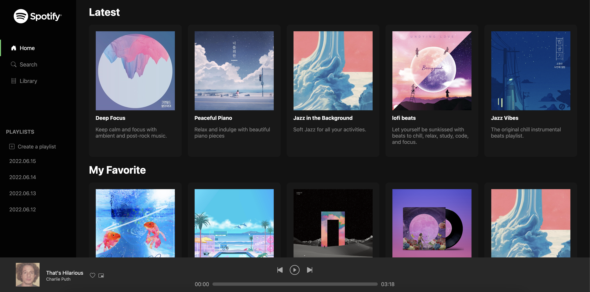

<div align="center">
    
    
    
    
</div>

* * *
## Spotify Clone
### 음악 스트리밍 서비스 스포티 파이 클론
* * *
* ### 실행 방법
``` 
    npm run dev
```
* * *
* ### 메인 페이지
</img>
* * *
* ## 느낀점 😎
### 처음으로 SSR(Server Side Rendering)기술인 Next.js를 사용하여 React로 웹을 제작해 보았다.
### 하지만 React의 장점인 부분적 렌더링을 제대로 활용해 보지 못한 점이 아쉽다.
